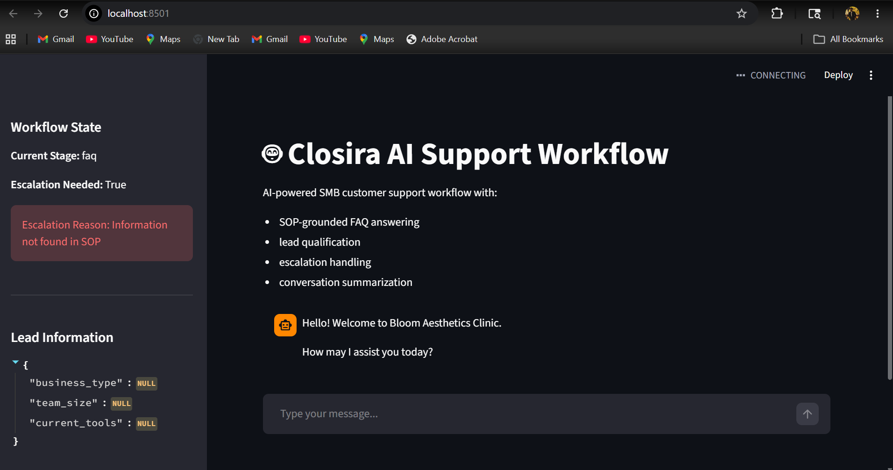

# Closira AI Support Workflow

A multi-stage AI-powered customer support workflow built for the Closira AI Engineering Internship Assignment.

The system simulates a real SMB customer-support workflow using OpenAI-compatible LLMs and SOP-grounded prompting.


# Features

- SOP-grounded FAQ answering
- Hallucination prevention
- Lead qualification workflow
- Escalation detection
- Confidence-based escalation
- Structured conversation summaries
- Conversation state management
- Logging and observability
- Multi-stage workflow orchestration
- Interactive Streamlit workflow dashboard
- Live workflow-stage visualization
- Real-time escalation monitoring
- SOP gap tracking UI

# UI Preview

## AI Workflow Dashboard



# Workflow Architecture


The workflow is divided into four stages:

## 1. FAQ Answering
The AI answers customer questions strictly using SOP data.

## 2. Lead Qualification
The AI collects:
- business type
- team size
- current customer support tools

## 3. Escalation Detection
The system escalates conversations when detecting:
- complaints
- frustration
- medical questions
- pricing negotiation
- low-confidence responses
- explicit human requests

## 4. Conversation Summary
At the end of the session, the AI generates a structured summary containing:
- customer intent
- lead information
- escalation history
- SOP gaps
- recommended next action

---

# Project Structure

```text
closira-ai-agent/
│
├── agents/
│   ├── escalation_agent.py
│   ├── faq_agent.py
│   ├── qualification_agent.py
│   └── summary_agent.py
│
├── data/
│   └── sop.json
│
├── logs/
│
├── test_transcripts/
│
├── utils/
│   ├── llm.py
│   ├── logger.py
│   └── state.py
│
├── app.py
├── prompt_design.md
├── README.md
└── requirements.txt
````

---

# Setup Instructions

## 1. Clone Repository

```bash
git clone <your_repo_url>
cd closira-ai-agent
```

---

## 2. Create Virtual Environment

```bash
python -m venv .venv
```

Activate environment:

### Windows

```bash
.venv\Scripts\activate
```

### Mac/Linux

```bash
source .venv/bin/activate
```

---

## 3. Install Dependencies

```bash
pip install -r requirements.txt
```

---

# Environment Variables

Create a `.env` file:

```env
GROQ_API_KEY=your_api_key
```

The project uses OpenAI-compatible APIs. During development/testing, Groq-hosted LLMs were used for inference.

---

# Run Application

```bash
python app.py
```

---

# Run Individual Tests

```bash
python test_faq.py
python test_escalation.py
python test_qualification.py
python test_summary.py
```

---

# Example Behaviors

## In-SOP Question

**Customer:**
What are your Botox prices?

**AI:**
Our Botox services start from £200.

---

## Out-of-Scope Question

**Customer:**
Do you provide hair transplant surgery?

**AI:**
I do not have information about hair transplant surgery in the SOP.

---

## Escalation Example

**Customer:**
I’m very frustrated with your service.

**AI:**
I’m escalating this conversation to a human support agent.

---

# Design Decisions

## SOP-Grounded Prompting

The AI is explicitly instructed to answer only from SOP data to prevent hallucinations.

## Modular Agent Architecture

The workflow is separated into:

* FAQ agent
* escalation agent
* qualification agent
* summary agent

This improves maintainability and orchestration clarity.

## Structured JSON Outputs

All LLM outputs use structured JSON for:

* reliability
* parsing safety
* workflow control

## Confidence-Based Escalation

Low-confidence responses automatically trigger escalation for safer customer interactions.

---

# Logging

The workflow logs:

* user messages
* AI responses
* escalations
* SOP gaps
* errors

Logs are stored in:

```text
logs/conversation.log
```

---

# Known Limitations

* CLI-only interface
* no persistent database
* no CRM integration
* no long-term memory across sessions

These tradeoffs were intentionally accepted to focus on workflow orchestration and AI reliability.

